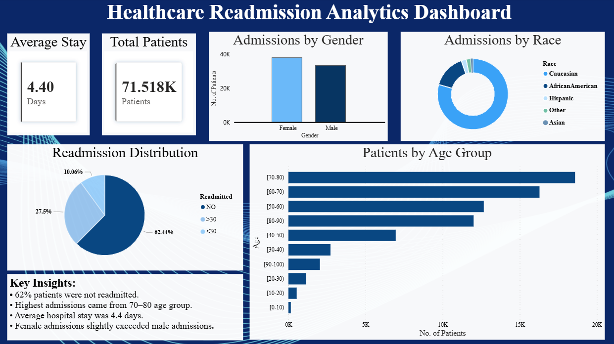

# Healthcare Readmission Analytics Dashboard

## Project Overview
This project analyzes healthcare readmission data using Python, SQL, and Power BI to identify trends in patient admissions, readmissions, demographics, and hospital stay durations.

## Tools & Technologies
- Python
- Pandas
- SQL
- Power BI

## Key Features
- Data cleaning and preprocessing
- Exploratory Data Analysis (EDA)
- Interactive Power BI dashboard
- Readmission trend analysis
- Demographic analysis by age, gender, and race

## Dashboard Preview



## Key Insights
- 62% patients were not readmitted
- Highest admissions came from 70–80 age group
- Average hospital stay was 4.4 days
- Female admissions slightly exceeded male admissions

## Project Structure


```text
Healthcare_Readmission_Analytics/
│
├── data/
├── notebooks/
├── dashboard/
├── sql/
└── README.md
```
